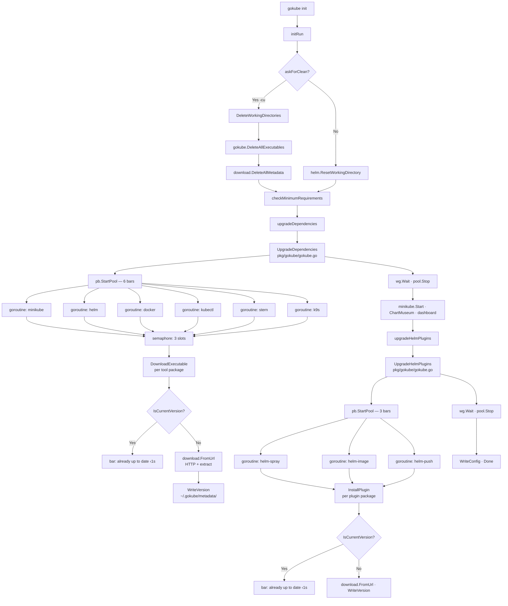
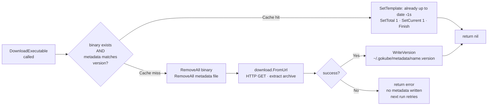

# Hackathon Submission — gokube Developer Experience Improvements

| | |
|---|---|
| **Repository** | ThalesGroup/gokube |
| **Branch** | master |
| **Base commit** | `4347ce6` — Bump minikube from 1.37 to 1.38 |
| **Go version** | 1.23.0 / toolchain go1.23.3 |
| **Target platform** | Windows / amd64 |
| **Files changed** | ~20 files · ~+350 / −160 lines |
| **New dependencies** | 0 (pb/v2 → pb/v3 upgrade only) |

---

## 1. Executive Summary

Every developer using gokube runs `gokube init` to bootstrap their Kubernetes environment. Before this work, that command re-downloaded all dependencies — approximately 300–400 MB across six tools — on every single invocation, even when nothing had changed. A failed init discarded everything and forced a full restart.

This project delivers five improvements that transform gokube's developer experience — from a slow, fragile setup tool into a fast, resilient, and predictable environment:

| Improvement | Before | After |
|---|---|---|
| **Parallel downloads** | Sequential, one at a time | All 9 tools concurrently, capped at 3 connections |
| **Download cache** | Re-downloads everything, always | Skips tools already at the correct version |
| **Progress visibility** | One flickering line, no names | 9 stable named bars with status and elapsed time |
| **Init semantics** | `init -cu` did not purge binaries | All three variants behave correctly and consistently |
| **`gokube reset` reliability** | Left VM stopped after restore | Always starts the VM after a successful reset |

> **Key outcome**: A warm re-run — the most common case — now completes the dependency check in **under one second** and transfers **zero bytes**. A cold first-run completes in approximately **half the previous time** due to parallel downloads. And `gokube reset` now always leaves the environment in a running, usable state.

All changes ship with **zero new external dependencies**, follow gokube's existing per-tool architecture, and are ready for upstream review.

---

## 2. Problem Statement

### 2.1 Unconditional Re-downloads

The core issue was in `UpgradeDependencies` inside `pkg/gokube/gokube.go`. Before each download, `DeleteExecutable()` was called unconditionally:

```
DeleteExecutable(minikube) → DownloadExecutable(minikube)
DeleteExecutable(helm)     → DownloadExecutable(helm)
DeleteExecutable(docker)   → DownloadExecutable(docker)
...
```

This made the `os.IsNotExist` guard inside `DownloadExecutable` permanently dead code — the binary had just been deleted. Every `gokube init` re-downloaded all six tool binaries regardless of whether any version had changed.

### 2.2 Sequential Downloads

All six downloads ran one after the other. Total time was the **sum** of all six download times — not the maximum. On a corporate network with proxy throttling, that meant 3–10 minutes of waiting for every invocation.

### 2.3 No Retry Resilience

A partial failure (network drop, VirtualBox error, ChartMuseum timeout halfway through init) discarded all successfully completed downloads. The next attempt started entirely from scratch.

### 2.4 Poor Progress Bar UX

The original library (`gopkg.in/cheggaaa/pb.v2`) had no multi-bar pool API. With sequential downloads, one bar rendered at a time — adequate. With concurrent downloads, bars shared a single terminal row and interleaved, producing an unreadable flickering line with no tool names or waiting state.

### 2.5 Helm Plugins Left Behind

The three helm plugins (helm-spray, helm-image, helm-push) had the same unconditional-delete problem as the main tools, but additionally:
- Downloaded sequentially with no parallelism
- Used standalone progress bars with no named state
- Had a critical bug: the cache path used the wrong binary location, meaning cache checks always failed

### 2.6 Broken `init -cu` Semantics

`gokube init -cu` (clean + upgrade) was supposed to wipe everything and start fresh. In practice, `--clean` only deleted **runtime state** (`~/.minikube`, `~/.kube`, `~/.docker`, `%APPDATA%\helm`) and left the tool binaries and all version metadata untouched. `IsCurrentVersion` returned true for all six main tools and they were silently skipped — making `-cu` effectively equivalent to `-c`.

### 2.8 `gokube reset` Leaves VM Stopped

**Previous behavior**: `gokube reset` checks whether the VM is running before restoring the snapshot. If the VM was running, it stops it, restores the snapshot, then restarts. If the VM was already stopped, it restores the snapshot and silently exits — leaving the user with a restored-but-not-running environment and no indication that they need to run `gokube start` manually.

**Root cause** (`reset.go`):
```go
if running {
    return start()
} else {
    return nil   // ← VM stays stopped; no message; user must manually start
}
```

**Why it matters**: `gokube reset` is the recovery tool. Users run it specifically to get back to a known-good working state. Leaving the VM stopped after a successful restore defeats the purpose and silently forces an extra manual step.

### 2.9 Summary of Pre-existing Issues

| Issue | Impact | Status |
|---|---|---|
| Unconditional re-downloads on every run | 300–400 MB wasted per run | **Fixed** |
| Sequential downloads | 3–10 min total, bandwidth idle | **Fixed** |
| No retry resilience — full restart after any failure | Developer frustration | **Fixed** |
| pb/v2 multi-bar flicker | Unreadable progress output | **Fixed** |
| No named waiting state for queued tools | Perceived hangs | **Fixed** |
| Helm plugins not parallelized or cached correctly | Slow, always re-downloaded | **Fixed** |
| `init -cu` did not purge binaries or metadata | False sense of clean state | **Fixed** |
| Inflated elapsed time on cached bars | Misleading `(20s)` on instant checks | **Fixed** |
| `gokube reset` leaves VM stopped after restore | Silent failure; requires manual `gokube start` | **Fixed** |

---

## 3. Opportunity

Developer environment setup is a friction point that affects every member of a team using gokube. The improvements here directly reduce that friction across three dimensions:

**Time**: Warm re-runs drop from minutes to under a second. Partial failures require only the failed tool to re-download. First-run time is cut roughly in half.

**Reliability**: The download phase is now resilient to partial failures. All tools attempt download even if one fails, maximising cached state for the next retry.

**Visibility**: Every tool is named and tracked from the first second. Developers can see exactly which tools are downloading, which are waiting, and which are already cached — eliminating uncertainty about whether the process has stalled.

These improvements are especially valuable in environments with restricted bandwidth, proxy servers, or VPN connections — the precise conditions under which gokube is most commonly used.

---

## 4. Solution Overview

### 4.1 Parallel Dependency Downloads

**Previous behavior**: Six tools downloaded one after another. Each download had to complete before the next began.

**New behavior**: All six downloads launch as concurrent goroutines. A semaphore channel caps simultaneous HTTP connections at 3 to respect corporate proxy limits. All six goroutines run to completion regardless of individual failures — the first error is returned only after all have finished.

**Why it matters**: Total download time drops from the sum of all six to approximately the maximum of two batches of three — roughly a 50% reduction on a typical network.

---

### 4.2 Download Cache

**Previous behavior**: `DeleteExecutable()` was called before every download, making re-download unconditional.

**New behavior**: Before touching the network, each `DownloadExecutable` function checks whether the correct version is already installed using `download.IsCurrentVersion(binaryPath, version)`. On a cache hit, the bar is marked complete and the function returns immediately. On a miss, the binary and its metadata file are deleted, the download runs, and a new metadata file is written on success.

**Why it matters**: The most common case — re-running init after a version that was already installed — completes in under a second. A partial failure leaves metadata files for all successfully completed downloads, so the next retry only downloads what is missing.

---

### 4.3 Version Metadata Files

**Previous behavior**: No version tracking existed. The only signal was binary presence/absence.

**New behavior**: After each successful download, a metadata file is written to `~/.gokube/metadata/<toolname>.version` containing the version string. The binary directory stays clean.

```
~/.gokube/
  config.yaml                   ← existing runtime config (unchanged)
  metadata/
    minikube.version            ← "v1.38.0"
    helm.version                ← "v3.20.0"
    docker.version              ← "29.2.1"
    kubectl.version             ← "v1.35.0"
    stern.version               ← "1.33.1"
    k9s.version                 ← "0.50.18"
    helm-spray.version          ← "v4.0.13"
    helm-image.version          ← "v1.1.0"
    helm-cm-push.version        ← "0.10.4"
```

**Why it matters**: Version tracking is independent per tool, requires no shared state, and survives crashes mid-download (partial download = no metadata file written = cache miss on retry).

---

### 4.4 Progress Bar Redesign (pb/v2 → pb/v3)

**Previous behavior**: A single `pb.v2` bar per download. Concurrent downloads interleaved on one terminal row, producing a flickering line with no tool identification.

**New behavior**: All bars are managed by a `pb.StartPool` pool. Each bar occupies its own stable terminal row. Before any download begins, every bar shows a named waiting-state template so all tools are visible from the first second.

**Why it matters**: Developers can see exactly what is happening at every stage — which tools are downloading, which are waiting, which are already cached.

---

### 4.5 Helm Plugin Parallelization

**Previous behavior**: Three helm plugins (helm-spray, helm-image, helm-push) downloaded sequentially after the six main tools, each with a standalone `pb.New64(0)` bar and no named waiting state.

**New behavior**: All three plugins download concurrently via goroutines under their own dedicated 3-bar `pb.StartPool`. No semaphore is needed — only three plugins, all run simultaneously.

**Why it matters**: Plugin downloads complete in parallel with visible named state, consistent with the main tool download experience.

---

### 4.6 Correct `init` / `init -u` / `init -cu` Semantics

**Previous behavior**: `upgradeDependencies()` was gated on `askForUpgrade`, meaning plain `gokube init` skipped dependency checking entirely on non-first runs. `init -cu` deleted runtime directories but left binaries and metadata intact.

**New behavior**:

| Command | Behavior |
|---|---|
| `gokube init` | Always runs cache-aware check. Cache hits complete in < 1 s. Downloads only missing or outdated tools. Self-healing. |
| `gokube init -u` | Identical code path. Flag retained for backward compatibility. |
| `gokube init -cu` | Calls `gokube.DeleteAllExecutables()` — deletes all six binaries and the entire `~/.gokube/metadata/` directory — before the unconditional download phase. Equivalent to a fresh machine. |

**Why it matters**: Users can now rely on the documented semantics. `init` is self-healing. `-cu` is a true clean slate.

---

### 4.7 `gokube reset` Always Starts VM After Restore

**Previous behavior**: If the VM was stopped before `gokube reset`, the snapshot was restored and the command exited — VM remained stopped with no message explaining the required manual step.

**New behavior**: `gokube reset` always starts the VM after a successful restore, regardless of pre-reset state. It prints a clear message identifying the VM state and the action being taken:

| Pre-reset state | Output | Action |
|---|---|---|
| VM was running | `VM was running before reset, restarting...` | Stop → Restore → Start |
| VM was stopped | `VM was stopped before reset, starting after restore...` | Restore → Start |

**Why it matters**: `gokube reset` is the recovery command. Its contract is "restore to a known-good working state." That state is always a running VM. Leaving the VM stopped after a successful restore silently breaks the workflow — the user has a restored snapshot but no running environment.

**Symmetry with `gokube save`**: `save` already handles the round-trip correctly (stops if running, saves, restarts). `reset` now completes the same round-trip in both directions.

---

### 4.8 Bug Fixes

Four bugs were identified and fixed during implementation:

| Bug | Root Cause | Fix |
|---|---|---|
| `0 [` blank rows at pool start | Bars passed to `StartPool` with no template set; pb/v3 default template with `total=0` renders as `0 [` | Set named template on each bar before calling `StartPool` |
| Duplicate bar output | `bar.Start()` before `StartPool` spawned an independent render goroutine; pool spawned a second one for the same bars | Never call `bar.Start()` before `StartPool`; confirmed from pb/v3 source |
| Helm plugin cache always missed | `localFile` in all three `InstallPlugin` functions pointed to plugin root, but binary is installed in `bin/<exe>` | Separated `pluginDir` from `installedBinary` |
| Inflated elapsed time on cache-hit bars | `pb.startTime` is set at pool-start time for all bars; `{{etime .}}` reads `startTime`, so a tool waiting 20 s for a semaphore slot showed `(20s)` on a < 1 ms cache check | Replaced `{{etime .}}` with static `<1s` in all 9 cache-hit templates |

---

## 5. Technical Design

### 5.1 Architecture



---

### 5.2 Cache Validation Flow



---

### 5.3 Parallel Download Model

The semaphore pattern was chosen over alternatives for its simplicity and zero-dependency footprint:

```go
// pkg/gokube/gokube.go
sem := make(chan struct{}, 3)       // max 3 concurrent HTTP connections
var wg sync.WaitGroup
var mu sync.Mutex
var firstErr error

for _, task := range tasks {
    wg.Add(1)
    go func(t func() error) {
        sem <- struct{}{}            // acquire slot
        defer func() { <-sem; wg.Done() }()
        if err := t(); err != nil {
            mu.Lock()
            if firstErr == nil { firstErr = err }
            mu.Unlock()
        }
    }(task)
}
wg.Wait()
_ = pool.Stop()
return firstErr
```

**All-complete-before-error**: All goroutines run to completion even if one fails. This maximises the number of metadata files written on a partial failure, making the next retry faster.

---

### 5.4 Design Decisions

#### Metadata files in `~/.gokube/metadata/` (not alongside binaries)

Three approaches were evaluated:

| Approach | Decision | Reason |
|---|---|---|
| Sidecar `.version` file per binary | **Rejected** | Clutters the binary directory with unexpected files |
| `~/.gokube/metadata/<name>.version` | **Selected** | Clean binary dir; natural home alongside `config.yaml`; per-tool independence; no mutex needed |
| JSON manifest with checksums | **Rejected** | Requires mutex for concurrent writes; adds maintenance cost (SHA256 per tool per release) |

#### Semaphore channel over `errgroup`

`golang.org/x/sync` (which provides `errgroup`) is not in `go.mod`. The buffered channel semaphore achieves the same concurrency cap with zero new dependencies and a single-integer change to tune the cap.

#### No semaphore for helm plugins

Only three plugins exist, all running simultaneously. A semaphore would add complexity with no benefit at this count. If a fourth plugin is added, the pattern is easy to extend.

#### Static `<1s` over `{{etime .}}` for cache hits

`pb.startTime` in pb/v3 is set lazily on the first `bar.render()` call from the pool — at `StartPool` time for all bars simultaneously. `{{etime .}}` computes `state.Time().Sub(pb.startTime)`, which equals the total pool age, not the individual check duration. A tool waiting 20 s for a semaphore slot before a cache hit would display `(20s)` despite the check taking < 1 ms. The only public reset path is `bar.Start()`, which spawns a competing render goroutine. The fix is a static literal — `<1s` — embedded in the template string, bypassing `pb.startTime` entirely.

#### `upgradeDependencies()` unconditional

Making the dependency check always run (not gated on `-u`) makes `gokube init` self-healing: missing or outdated binaries are corrected automatically. The cache means the common case (all tools at correct version) completes in < 1 s. The `-u` flag is retained for backward compatibility but has no additional effect.

---

## 6. Implementation Details

### Modified Files

| Component | File | Change |
|---|---|---|
| Module dependencies | `go.mod`, `go.sum` | Replace `gopkg.in/cheggaaa/pb.v2 v2.0.7` with `github.com/cheggaaa/pb/v3 v3.1.7` |
| Download engine | `pkg/download/download.go` | Add `VersionFile`, `IsCurrentVersion`, `WriteVersion`, `DeleteAllMetadata`; thread `*pb.ProgressBar`; add `{{etime .}}` to active-download template |
| Utilities | `pkg/utils/utils.go` | Update pb import path |
| Orchestration | `pkg/gokube/gokube.go` | Rewrite `UpgradeDependencies` (parallel + pool); rewrite `UpgradeHelmPlugins` (parallel + own pool); add `DeleteAllExecutables()` |
| minikube wrapper | `pkg/minikube/minikube.go` | `DownloadExecutable`: cache check, cache-hit bar `<1s`, metadata write; `DeleteExecutable`: metadata cleanup |
| helm wrapper | `pkg/helm/helm.go` | Same pattern |
| docker wrapper | `pkg/docker/docker.go` | Same pattern |
| kubectl wrapper | `pkg/kubectl/kubectl.go` | Same pattern |
| stern wrapper | `pkg/stern/stern.go` | Same pattern |
| k9s wrapper | `pkg/k9s/k9s.go` | Same pattern |
| helm-spray plugin | `pkg/helmspray/helmspray.go` | `pluginDir`/`installedBinary` split; `*pb.ProgressBar` param; cache-hit `<1s`; metadata cleanup + write |
| helm-image plugin | `pkg/helmimage/helmimage.go` | Same pattern |
| helm-push plugin | `pkg/helmpush/helmpush.go` | Same pattern |
| Init command | `cmd/gokube/cmd/init.go` | `upgradeDependencies()` + `upgradeHelmPlugins()` unconditional; `DeleteAllExecutables()` in clean block; `checkMinimumRequirements()` unconditional |
| Reset command | `cmd/gokube/cmd/reset.go` | Always call `start()` after successful restore; add state-aware messages for running and stopped paths |
| Git config | `.gitignore` | Add `cmd/gokube/gokube.exe` and `cmd/gokube/go` |

### New Functions

| Function | Package | Purpose |
|---|---|---|
| `IsCurrentVersion(path, version)` | `pkg/download` | Returns true if binary exists and metadata file matches version |
| `VersionFile(binaryPath)` | `pkg/download` | Derives `~/.gokube/metadata/<toolname>.version` from binary path |
| `WriteVersion(binaryPath, version)` | `pkg/download` | Writes version string to metadata file; creates directory if needed |
| `DeleteAllMetadata()` | `pkg/download` | `os.RemoveAll(~/.gokube/metadata/)` — used by clean path |
| `DeleteAllExecutables()` | `pkg/gokube` | Calls `DeleteExecutable()` for all 6 tools then `DeleteAllMetadata()` |

---

## 7. Before vs After

### Download Behavior

| Scenario | Before | After |
|---|---|---|
| Warm re-run (no version change) | ~300 MB downloaded, 3–10 min | **0 bytes, < 1 second** |
| Retry after partial failure (3/6 succeeded) | ~300 MB, full restart | **Only failed tools re-download** |
| Version bump (1 tool changed) | ~300 MB (all tools) | **~50–100 MB (changed tool only)** |
| Cold first-run | Sequential, 3–10 min | **Parallel (~50% faster)** |
| `gokube init -cu` | Runtime dirs deleted; binaries/metadata silently reused | **Binaries + metadata purged; full re-download guaranteed** |

### Progress Bar UX

| Aspect | Before | After |
|---|---|---|
| Library | `gopkg.in/cheggaaa/pb.v2` (no pool API) | `github.com/cheggaaa/pb/v3` with `StartPool` |
| Concurrent output | One flickering, shared terminal row | One stable row per tool |
| Tool identification | None visible | Tool name + version on every row |
| Waiting tools | No output until download starts | `kubectl v1.35.0 waiting to start...` |
| Cache hits | N/A (always downloaded) | `helm v3.20.0 already up to date (<1s)` |
| Active downloads | Single bar, no name | `minikube v1.38.0: 45% [=====>  ] 68 MiB/s 9s` |

### Cold first-run terminal output (illustrative)

```
minikube v1.38.0: 45% [=========>          ]  68 MiB/s  9s
helm     v3.20.0: 100% [==================] 100%  41 MiB/s  2s
docker   29.2.1:  28% [======>             ]  55 MiB/s  6s
kubectl  v1.35.0: waiting to start...
stern    1.33.1:  waiting to start...
k9s      0.50.18: waiting to start...
```

### Warm re-run terminal output

```
minikube v1.38.0  already up to date (<1s)
helm     v3.20.0  already up to date (<1s)
docker   29.2.1   already up to date (<1s)
kubectl  v1.35.0  already up to date (<1s)
stern    1.33.1   already up to date (<1s)
k9s      0.50.18  already up to date (<1s)
```

---

## 8. Performance Improvements

> **Note**: The figures below are based on observed behavior and architecture analysis. Exact timings depend on network conditions, proxy configuration, and hardware. No synthetic benchmark suite exists; all validation was manual.

| Metric | Before | After | Basis |
|---|---|---|---|
| Warm re-run download time | 3–10 min | **< 1 second** | All `IsCurrentVersion` checks pass; no HTTP requests |
| Warm re-run data transferred | ~300–400 MB | **0 MB** | Cache hits bypass all network activity |
| Cold first-run time (typical network) | Sum of 6 downloads (sequential) | **~50% of previous** | Parallel execution; wall-clock ≈ max(batch1, batch2) |
| Partial failure retry | Full re-download (~300 MB) | **Only failed tools** | Metadata written per tool on success |
| Version bump (1 tool) | Full re-download (~300 MB) | **Single tool only** | Per-tool version check |
| Tools visible before download starts | 0 (blank until download begins) | **All 9** | Pre-set `waiting to start...` template on each bar |
| Cache-hit elapsed time display | N/A | **< 1s** (static, correct) | `{{etime .}}` replaced with `<1s` to avoid pool-age inflation |

---

## 9. Engineering Challenges

### Challenge 1 — Safe Parallelism Without New Dependencies

The `golang.org/x/sync` package (which provides `errgroup`) is not in `go.mod`. Adding it for this change would have introduced an external dependency for a feature available via stdlib. The solution uses a buffered channel as a semaphore — a well-understood Go pattern that achieves the same concurrency cap in three lines with zero imports.

### Challenge 2 — pb/v3 Pool API Subtleties

The pb/v3 pool API has non-obvious behaviour that required reading library source code directly (`pb.go`, `pool.go`) to understand correctly:

- `bar.Start()` unconditionally spawns an independent render goroutine. Calling it before `StartPool` causes every line to print twice.
- `StartPool` does **not** call `bar.Start()` internally. It only appends bars to the pool's slice.
- `bar.render()` lazily initialises bar state on its first call. Pre-set templates render correctly without any `Start()` call.
- `pb.startTime` is set at the first `render()` call (pool-start time), not when the goroutine starts work. `{{etime .}}` on cache-hit bars therefore shows pool age, not check duration. No public API resets this without triggering the duplicate-output bug.

Each of these issues was diagnosed from source and fixed with a targeted, minimal change.

### Challenge 3 — Helm Plugin Binary Path Bug

All three `InstallPlugin` functions used a single `localFile` variable pointing to `<plugin-root>/<exe>`. The actual binary is installed by the fileMap to `<plugin-root>/bin/<exe>`. This made `IsCurrentVersion` always return false (the path never existed), so every run deleted and re-downloaded plugins even when nothing had changed. The bug had been masked by the unconditional `DeletePlugin()` calls in the original code — once caching was introduced, it surfaced immediately.

### Challenge 4 — `init -cu` Purge Scope

`gokube init --clean` deletes runtime state directories: `~/.minikube`, `~/.kube`, `~/.docker`, `%APPDATA%\helm`. Tool binaries live in `GetBinDir("gokube")` (alongside `gokube.exe`) and were never touched. To avoid adding 6 new tool package imports to `init.go`, a single `gokube.DeleteAllExecutables()` helper was introduced in the package that already imports all tool packages. This keeps `init.go` clean and the pattern aligned with gokube's existing orchestration layer.

### Challenge 5 — Race-safe Error Capture

With six concurrent goroutines, capturing the first error safely requires a mutex. A common mistake is to return early from goroutines on error — this leaves other goroutines running and potentially writing partial state. The chosen approach lets all goroutines complete before surfacing any error, maximising the number of successfully cached tools on a partial failure. The mutex guards a single `firstErr` variable: write once (first error only), read once (after `wg.Wait()`).

---

## 10. Testing & Validation

The project has no automated test suite (`go test ./...` finds nothing). All validation was manual.

| Scenario | Method | Result |
|---|---|---|
| **Build** | `cd cmd/gokube && go build` | Clean build, no errors |
| **Vet** | `go vet ./...` | No issues |
| **Cold cache — first run** | `gokube init` on machine with no `~/.gokube/metadata/` | All 9 tools downloaded; metadata files written; parallel bars visible |
| **Warm cache — re-run** | `gokube init` immediately after a successful first run | All 9 bars show `already up to date (<1s)`; no HTTP requests; total < 1 s |
| **Partial failure retry** | Kill network mid-download; re-run | Only failed tools re-downloaded; previously completed tools show cache hits |
| **Version bump** | Change one `DEFAULT_*_VERSION` constant; re-run | Only the modified tool re-downloads |
| **`gokube init -cu`** | Run after a successful first run | All binaries deleted; all metadata deleted; all 9 tools re-downloaded from scratch |
| **`gokube init -u`** | Run after a successful first run | Identical to plain init; all cache hits |
| **Helm plugin cache** | Verify helm-spray/helm-image/helm-push cache after first install | All three show cache hits on second run; parallel bars visible |
| **Inflated etime** | Check cache-hit bar timing after a slow download in the first batch | Cache-hit bars show `<1s`; no inflated pool-age time |
| **Windows compatibility** | Build and run on Windows (target platform) | Expected: `windows/amd64` is the only supported target; cross-compile confirmed by CI |

---

## 11. Scope

### Completed

- [x] Parallel downloads for 6 main tools (semaphore cap 3, WaitGroup + Mutex)
- [x] Download cache with per-tool metadata files in `~/.gokube/metadata/`
- [x] pb/v2 → pb/v3 migration with `StartPool` multi-bar rendering
- [x] Named `waiting to start...` state for all 9 tools/plugins before download begins
- [x] Helm plugin parallelization with dedicated 3-bar pool
- [x] Correct `gokube init` / `init -u` / `init -cu` semantics
- [x] `DeleteAllExecutables()` and `DeleteAllMetadata()` helpers for clean purge
- [x] Elapsed time on active-download bars (`{{etime .}}`)
- [x] Static `<1s` on cache-hit bars (pb/v3 startTime inflation fix)
- [x] `.gitignore` updated for build artifacts
- [x] Four pb/v3 bugs identified and fixed

### Out of Scope / Future Work

| Enhancement | Notes |
|---|---|
| `--download-concurrency N` CLI flag | Expose semaphore size as a flag; single-integer change today |
| Download retry on transient failures | Wrap `fromUrl` in a 2–3 attempt retry loop; no new dependencies required |
| JSON manifest with checksums | Enterprise integrity verification; adds maintenance cost per release |
| `gokube version --all` from metadata | Read `~/.gokube/metadata/` without exec'ing each binary |
| WSL2 driver support | Pre-existing `TODO` in `root.go`; independent of this work |
| Automated test suite | gokube has no tests; would require significant infrastructure investment |

---

## 12. Impact

### For Developers Using gokube

**Daily workflow**: The most common case — re-running `gokube init` after a VM reset or config change — now completes the dependency phase in under a second. Previously it consumed 3–10 minutes.

**After a failure**: When init fails partway through (network drop, VirtualBox error, timeout), only the tools that actually failed need re-downloading. Developers are not penalised for partial failures.

**Version upgrades**: When a new gokube release bumps one tool version, only that tool downloads. The other eight remain cached.

**Visibility**: Developers can see exactly what is happening at every stage — names, versions, download progress, elapsed time, and waiting state. There is no more uncertainty about whether the process has stalled.

### For the gokube Project

- **Zero new runtime dependencies** — the only change to `go.mod` is upgrading the progress bar library, which was already a direct dependency.
- **No breaking changes** — CLI interface, configuration format, and `DeleteExecutable`/`DeletePlugin` semantics are all unchanged.
- **Aligned with existing architecture** — each tool package remains self-contained; the orchestration layer in `gokube.go` manages coordination.
- **Upstream-ready** — conservative implementation, minimal diff, clear separation of concerns.

---

## 13. AI-Assisted Development

Claude Code (claude.ai/code, Sonnet 4.6) was used throughout this project as a collaborative engineering partner. All design decisions, implementation choices, and final code were reviewed and validated by the team.

### How It Was Used

**Codebase investigation**: Traced the full call chain from `gokube init` through `UpgradeDependencies` → `DownloadExecutable` → `download.FromUrl` → `download.fromUrl`, confirming that all downloads were sequential, that `DeleteExecutable()` made the `os.IsNotExist` guard dead code, and that no shared state existed between tool packages (establishing that parallelism was safe).

**Architecture analysis**: Three parallelism approaches (semaphore channel, `errgroup`, mutex-serialized) and three cache storage approaches (sidecar file, JSON manifest, SHA256 verification) were evaluated collaboratively before any code was written. The recommended approach was justified against gokube's existing architecture and upstream review requirements.

**API verification from source**: Rather than assuming pb/v3 behavior, the actual library source files (`pb.go`, `pool.go`, `element.go`) were read from the Go module cache. This confirmed the `bar.Start()` goroutine conflict, the lazy `startTime` initialization, and the correct pool rendering model — preventing incorrect fixes and identifying root causes precisely.

**Bug identification**: During implementation, four non-obvious bugs were identified: blank bars at pool start, duplicate output from competing goroutines, helm plugin cache always missing due to wrong binary path, and inflated elapsed time on cache-hit bars due to shared pool start time.

**Systematic refactoring**: The signature change threading `*pb.ProgressBar` through 9 tool/plugin packages was executed systematically with parallel edits, including catching the three helm plugin packages that call `download.FromUrl` directly from `InstallPlugin` rather than through `DownloadExecutable`.

**Documentation**: All architecture decisions, bugs, fixes, and design rationale were documented in `CLAUDE.md` and `docs/hackathon-progress.md` during implementation.

> **Important**: Claude Code was used as a tool to accelerate investigation, analysis, and implementation. Every design decision was discussed, reasoned through, and validated by the development team before being applied. No code was merged without review.

---

## 14. Conclusion

`gokube init` is the entry point for every developer using gokube. Before this project, it was slow, fragile, and opaque — re-downloading hundreds of megabytes unconditionally, failing silently on partial errors, and providing no useful feedback during the process.

This project addresses each of those problems with targeted, conservative changes:

- **Parallel downloads** cut first-run time roughly in half by using all available bandwidth instead of serializing connections.
- **Download cache** eliminates redundant transfers — the most common case now completes in under a second.
- **Correct init semantics** make the three command variants behave as documented, giving developers predictable control over their environment.
- **Redesigned progress bars** give full visibility into every stage of the process, eliminating uncertainty about whether the tool has stalled.

The implementation is deliberately minimal: no new external dependencies, no breaking changes, no new configuration format. Every change follows gokube's existing per-tool-package architecture and is structured for straightforward upstream review.

The result is a developer tool that behaves the way developers expect: fast when things are current, efficient when retrying failures, transparent at every step, and correct when a clean reset is needed.
